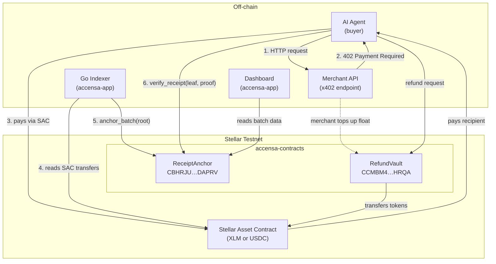
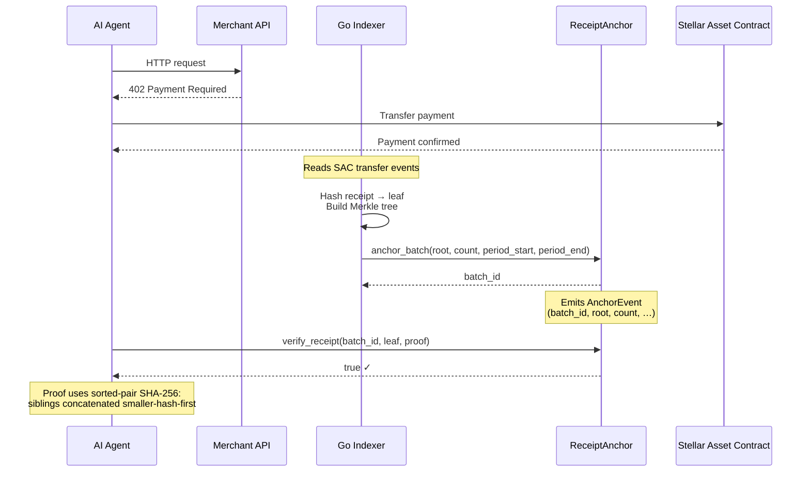
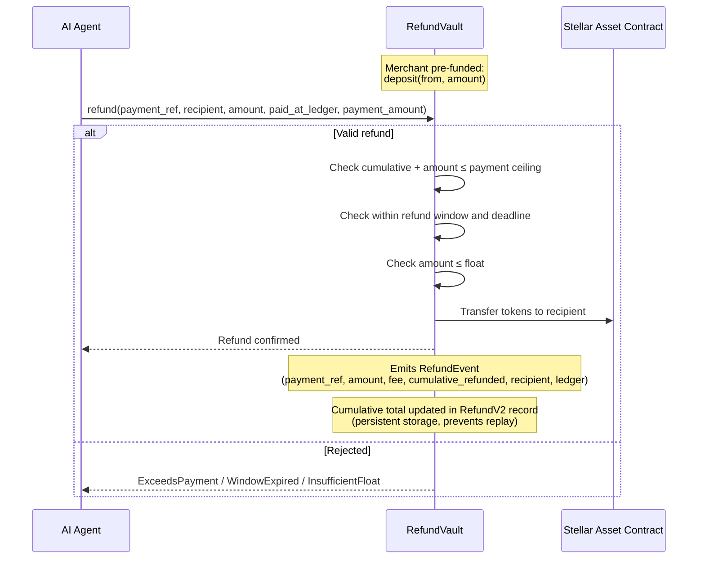
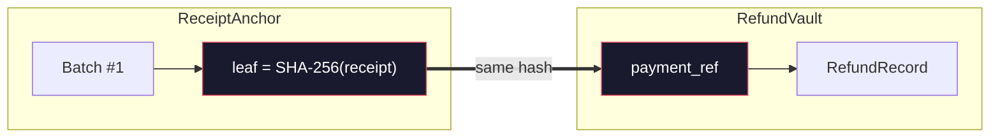

# Architecture

Visual overview of how `ReceiptAnchor` and `RefundVault` interact on testnet.
Both contracts are independent on-chain programs that share no storage — they
are linked only by a common identifier (`payment_ref` = receipt leaf hash).

For the threat model, see [SECURITY_MODEL.md](SECURITY_MODEL.md).
For live contract IDs and verification commands, see [DEPLOYMENTS.md](../DEPLOYMENTS.md).

## System Overview

## Receipt Anchoring Flow

The indexer aggregates individual payment receipts into a Merkle tree and
anchors the root on-chain in a single transaction. Agents can then verify
their receipt independently — no trusted API in the path.

## Refund Flow

Refunds are policy-bounded: each `payment_ref` can only be refunded once,
must fall within the refund window, and cannot exceed the vault float.

## Cross-Contract Relationship

The two contracts share no storage and have no direct function calls. They are
linked by a single shared key:

| Contract | Field | Value |
|---|---|---|
| `ReceiptAnchor` | Merkle leaf | SHA-256 hash of the payment receipt |
| `RefundVault` | `payment_ref` | Same SHA-256 hash |

This 1:1 mapping means a refund in `RefundVault` explicitly corresponds to an
anchored receipt in `ReceiptAnchor`. The refund does **not** require the batch
to still exist — pruning or archiving a batch has no effect on refund validity.

## Testnet Deployment Context

Both contracts are deployed on Stellar testnet (v0.1.0). Key details:

| Property | Value |
|---|---|
| Merchant / admin | `GCALKSGAZRJLSUEJT3M5W6LN4R7XQOLIRCOS6ZA6EDZVTZDBIIPPFKJ6` |
| Refund token | Native XLM SAC (`CDLZFC3…YSC`) |
| Refund window | 17,280 ledgers (~24h) |
| Max batch size | 1,000 receipts |
| Storage TTL | ~30 days (~518,400 ledgers) |

> **Note:** The testnet contracts run v0.1.0 while `main` is at v0.2.0. The
> v0.2.0 functions (`prune_batches`, `pause`, `unpause`, etc.) are not available
> at the deployed addresses. See [DEPLOYMENTS.md](../DEPLOYMENTS.md) for details.
